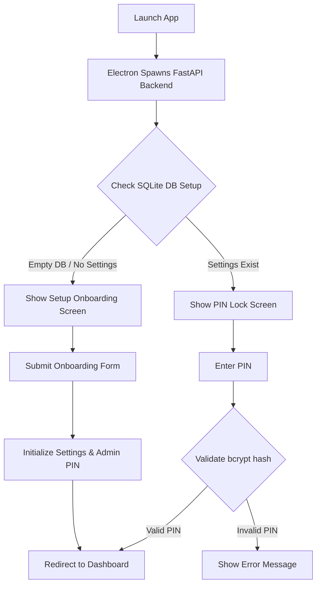
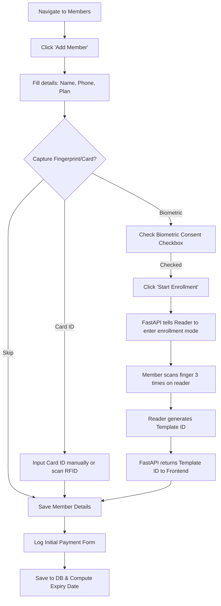
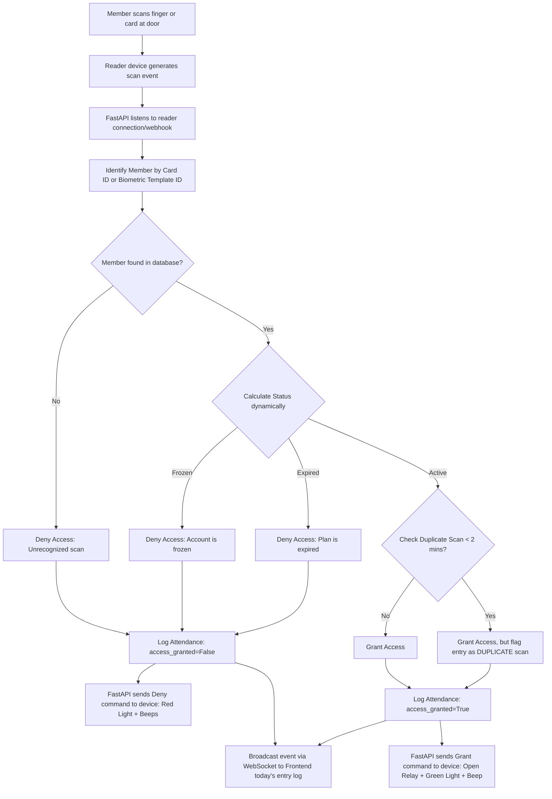
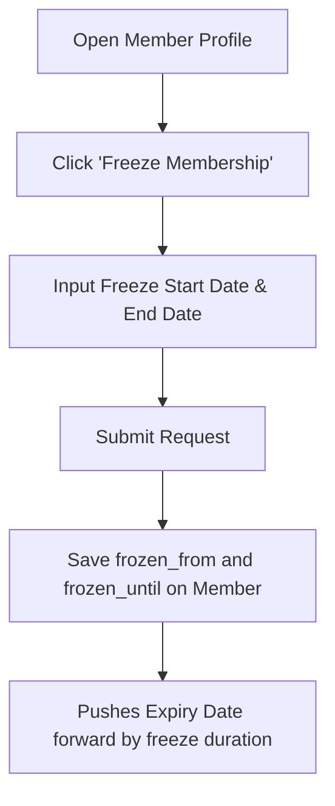
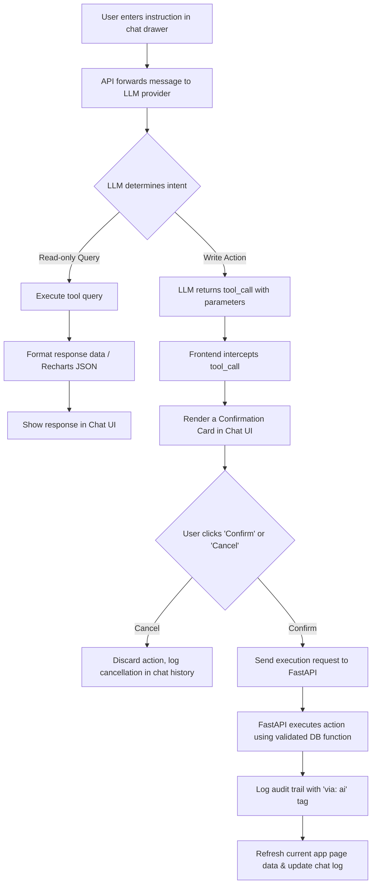

# Application Flow Specification

This document details the step-by-step user journeys and backend execution flows for key actions in the Gym Management System.

---

## 1. Startup & Authentication Flow

### Steps:
1. **Initialization**: Electron starts up, runs PyInstaller's backend binary on a dynamically selected local port, and loads the React UI.
2. **Onboarding (First-time launch)**:
   - Prompt the user to enter Gym Name, Owner Name, Contact Phone, PIN code, and Access Policy.
   - Must present the **Biometric Consent Policy** statement for review.
3. **Authentication**:
   - Admin enters the PIN code. The client sends it to the backend for verification using `bcrypt` comparison.
   - Upon successful verification, the app sets a client-side session flag (unlocked state).

---

## 2. Member Onboarding & Biometric Enrollment Flow

### Steps:
1. **Consent Gate**: The "Start Enrollment" button remains disabled until the operator checks the "Biometric Consent Given" checkbox (mandatory under India DPDP Act compliance).
2. **Device Communication**:
   - Frontend sends a request to the backend: `POST /api/hardware/enroll`.
   - The backend puts the ZKTeco/Mantra reader into enrollment mode.
   - The reader prompts the member (via screen/lights) to scan their finger 3 times to construct a template.
3. **Template Assignment**:
   - Once enrolled, the backend saves the numeric biometric template pointer in the reader memory and returns the pointer ID to the frontend.
   - The frontend includes this `biometric_template_id` (or RFID `card_id`) in the member creation payload.

---

## 3. Physical Access Control Flow (Real-time Gate)

This flow is critical and must execute in **under 1 second** to prevent queues at the gym entrance.

### Steps:
1. **Default Fail-Open**: If the backend, reader, or database connection is offline, the physical hardware defaults to its hardware fail-open state (unlocked).
2. **Duplicate-Scan Flagging**:
   - The system queries recent attendance logs for the member.
   - If an entry exists within the past 2 minutes, it is still allowed through (so members aren't stuck if they scan twice by accident), but flagged in the logs and UI to prevent card sharing.

---

## 4. Membership Freeze & Unfreeze Flow

### Expiry Date Adjustment Math:
- When a freeze is applied, the backend shifts the `expiry_date` forward by `(frozen_until - frozen_from) + 1` days.
- If the freeze is modified or cancelled early, the expiry date is dynamically recalculated to ensure the member only receives credit for the days the membership was actually paused.

---

## 5. AI Assistant Action Authorization Flow

To prevent prompt injection, accidental writes, or incorrect target manipulations:

